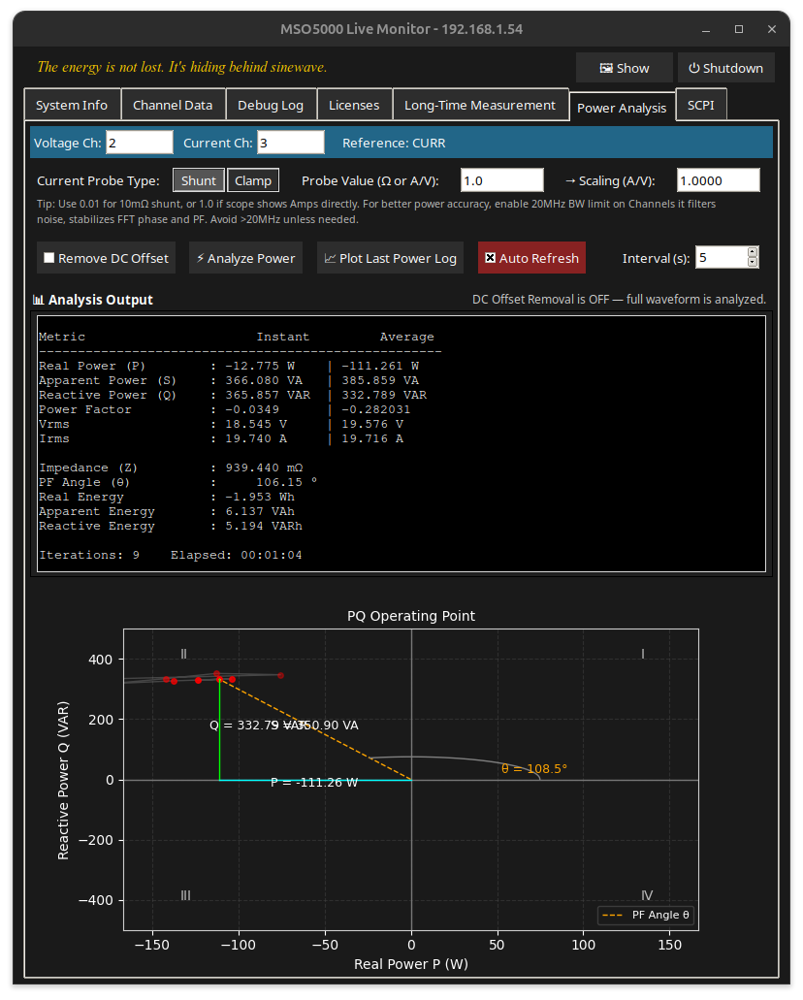
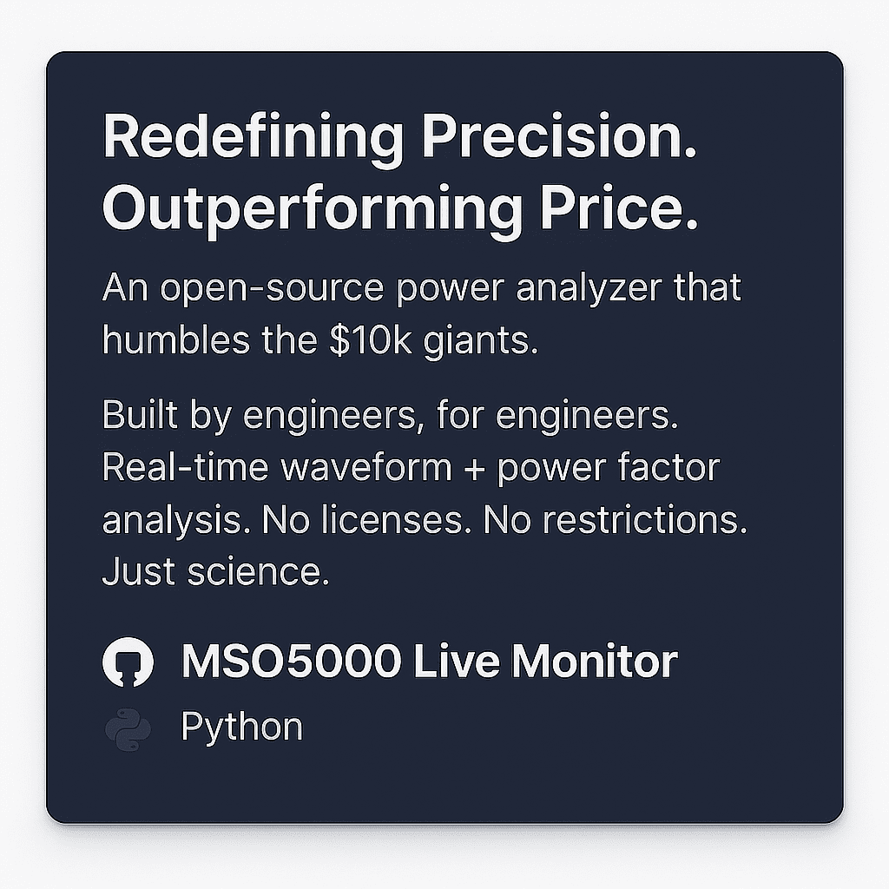

# 🧠 RIGOL MSO5000 Live Monitor (Hacked FW Compatible)

> **Current Version:** v0.9.5  
> 📦 See [Release Notes](https://github.com/ariDev1/MSO5000_liveview/releases/tag/v0.9.5)

This tool provides a live view and SCPI-based data extraction from a **Rigol MSO5000** oscilloscope with **hacked firmware**, using VNC for screenshots and VISA (SCPI) for waveform data.



---

## 🧩 Features

- 📷 Live screenshots from the oscilloscope (via VNC)
- 📊 Channel settings: coupling, bandwidth, scale, offset, probe
- ⏱️ Trigger and timebase information
- 📈 Waveform measurements: Vpp, Vavg, Vrms (up to 4 channels)
- 📤 CSV export of waveform data
- 🧪 **Long-time measurement mode with pause/resume/stop**  
  ↪️ Saves all data to a single timestamped CSV  
  ↪️ Timestamped rows at user-defined intervals  
  ↪️ Performance tips built into the UI
- 🧠 **Live Power Analyzer** with PQ chart and scaling  
  ↪️ Real-time P/S/Q/PF/Vrms/Irms calculations  
  ↪️ Probe scaling (shunt/clamp + unit conversion)  
  ↪️ Display of PF angle and cumulative energy  
  ↪️ Heatmap-style PQ trail with fading  
  ↪️ Shows `Reference: CURRENT` or `VOLTAGE` from scope
- 🐞 Scrollable debug log
- ⚙️ Manual SCPI tab with command input and response log  
  ↪️ Command list from `scpi_command_list.txt` (click or double-click to load)  
  ↪️ Error-safe querying with response log  
  ↪️ Full debug trace included
- 🌙 Dark mode GUI with resizable window and tabs
- 🐳 **Docker support** for easy deployment (X11 + Wayland)

---

## 🛠️ Installation (Tested on Ubuntu 24.04 Noble)

### 📦 Native Python Setup

```bash
sudo apt install python3-tk python3.12-venv

git clone https://github.com/ariDev1/MSO5000_liveview.git
cd MSO5000_liveview/
python3 -m venv venv
source venv/bin/activate
pip install -r requirements.txt
python3 main.py
```

Or use the prewritten install script:

```bash
bash how-to-install.txt
```

> 💡 Tested on Ubuntu 24.04 LTS with Python 3.12 and VNC enabled on the Rigol scope.

---

## 🐳 Docker Support (X11 and Wayland compatible)

You can run this app in a **Docker container with GUI**.

### 🔧 Build the Image

```bash
docker build -t mso5000_liveview .
```

### 🚀 Run It

```bash
./run.sh
```

The script auto-detects X11 or Wayland and sets up display bridging.

### 📁 Where Are My CSV Files?

All exported CSV files go to:

```bash
~/oszi_csv/
```

This folder is mounted into the container.

---

## 📦 Python Requirements

Create a virtual environment first:

```bash
python3 -m venv venv
```
Then install with:

```bash
pip install -r requirements.txt
```

Required packages:
- `pillow`, `numpy`, `pyvisa`, `pyvisa-py`
- `requests`, `vncdotool`, `psutil`, `zeroconf`

---

## 🖧 Prerequisites

- Rigol MSO5000 on **same local network**
- **VNC enabled** on the oscilloscope
- **SCPI over TCP/IP enabled**
- Know the IP address of the scope

---

## 🚀 How to Use

Launch the app:

```bash
python3 main.py
```

Enter the oscilloscope’s IP when prompted. GUI includes:

- 🔍 Live screenshot
- 📂 Tabbed interface:
  - System Info
  - Channel Data
  - Debug Log
  - Licenses
  - Long-Time Measurement (with CSV export)
  - SCPI
  - Power Analysis

---

## 📁 File Structure

```
MSO5000_liveview/
├── Dockerfile
├── run.sh
├── .dockerignore
├── main.py
├── build_version.py
├── version.py          ← auto-generated
├── requirements.txt
├── how-to-install.txt
├── oszi_csv/           ← output folder for logs
├── docs/
│   └── screenshot.png
```

---

## ⚠️ Firmware Notice

This tool targets **hacked firmware** (unofficial). Compatibility improvements include:

- Skipping problematic SCPI commands
- Handling timeouts gracefully
- Adapting to patched behavior

---

## 📃 License

This project is for **educational and personal use only**.  
Not affiliated with Rigol Technologies.

---

## 📖 Changelog

See [CHANGELOG.md](CHANGELOG.md) for full version history.


