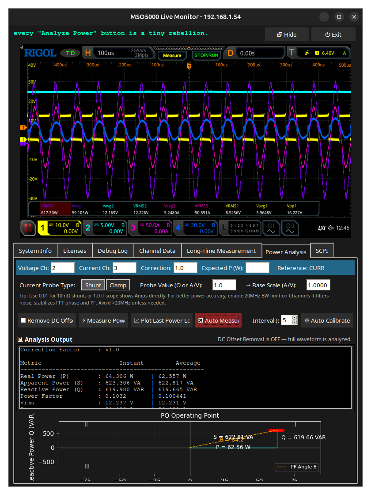

# 🧠 RIGOL MSO5000 Live Monitor (Hacked Firmware Compatible)

This tool provides a live GUI-based monitor for **Rigol MSO5000 series** oscilloscopes (including those with hacked firmware). It offers real-time waveform screenshots, SCPI data logging, waveform exports, and debug insight.

## ✨ Features

- Live screen capture via VNC from the oscilloscope
- Query of timebase, trigger, and channel configuration
- Automatic logging of Vpp, Vavg, and Vrms values for selected channels
- CSV waveform export per channel with full metadata
- Dark-mode GUI with scrollable debug log
- Pause/resume/stop support for long-time measurement
- Safe operation with hacked firmware (timeout-aware)

## 🖼️ Screenshot



---

## 🚀 How to Use

```bash
python3 main.py
```

You will be prompted to enter the IP address of the Rigol MSO5000.

### Prerequisites

- VNC must be enabled on the oscilloscope
- SCPI over TCP/IP must be reachable (default port 5555 or VISA-compatible)
- Device must be on the same LAN as your computer

---

## 🧪 Logging Measurement Data

- Select channels (e.g. `1,2`)
- Enter duration (in **hours**) and interval (in **seconds**)
- Optionally enable Vavg and Vrms checkboxes
- Start the logging session

Results are saved to a CSV file under:

```
oszi_csv/session_<timestamp>/session_log.csv
```

> ⚠️ **Note:** Logging all 4 channels with sub-second intervals may cause backlog delays on slower firmware. For long-time measurements (e.g. 24h), intervals ≥ 1s are recommended.

---

## 🗂 Export Channel Waveforms

Use the “📥 Export Channel CSV” button to fetch all currently visible waveforms (1–4) as full CSV exports with metadata headers.

Each channel CSV includes:

- Time (s)
- Voltage (V)
- Device metadata (ID, timebase, scale, offset, etc.)

---

## ⚙️ Configuration

In `main.py` and the `config.py` files you can adjust:

| Variable         | Description                            | Default |
|------------------|----------------------------------------|---------|
| `INTERVALL_BILD` | Screenshot update interval (seconds)   | 2       |
| `INTERVALL_SCPI` | SCPI query interval (seconds)          | 4       |
| `WAV_POINTS`     | Waveform sample points per channel     | 1200    |

---

## 📦 Installation Requirements

Create a virtual environment (optional but recommended):

```bash
python3 -m venv venv
source venv/bin/activate
```

Then install dependencies:

```bash
pip install -r requirements.txt
```

### System Packages (Ubuntu/Debian)

```bash
sudo apt install python3-tk python3-pil.imagetk vncdo
```

---

## 📁 Project Structure

```
MSO5000_liveview/
├── main.py                # Entry point for the GUI
├── config.py              # Customizable constants
├── scpi/                  # SCPI tools and waveform handling
├── rigol_vnc_liveview8.py# GUI components (called from main.py)
├── oszi_csv/              # Measurement + export logs
├── requirements.txt       # Python dependencies
└── README.md              # This file
```

---

## 🧾 License

This project is for **personal, educational, and diagnostic use** only.

Not affiliated with Rigol Technologies. Use at your own risk.
